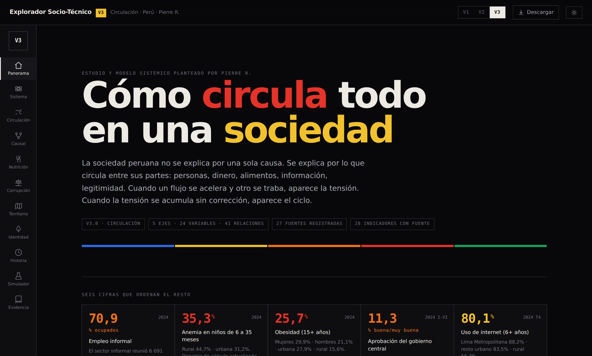
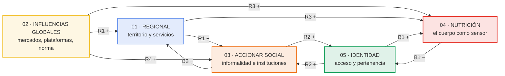
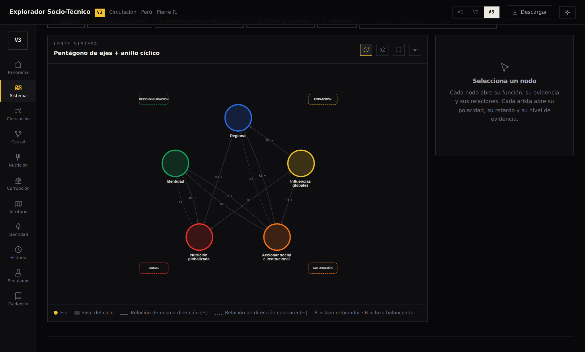
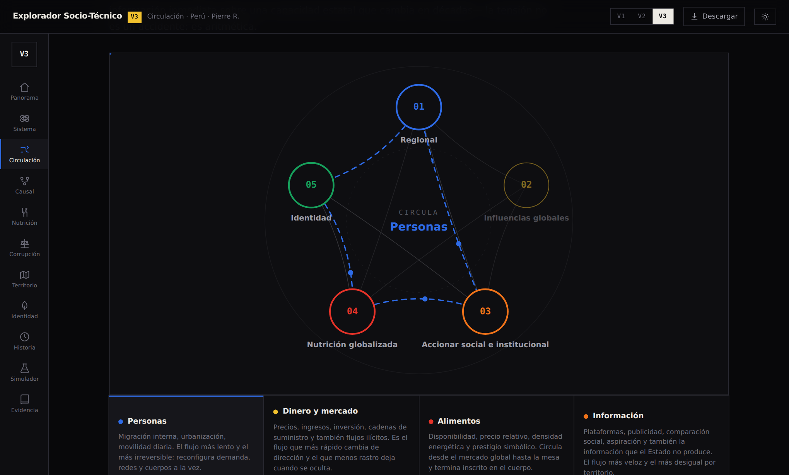
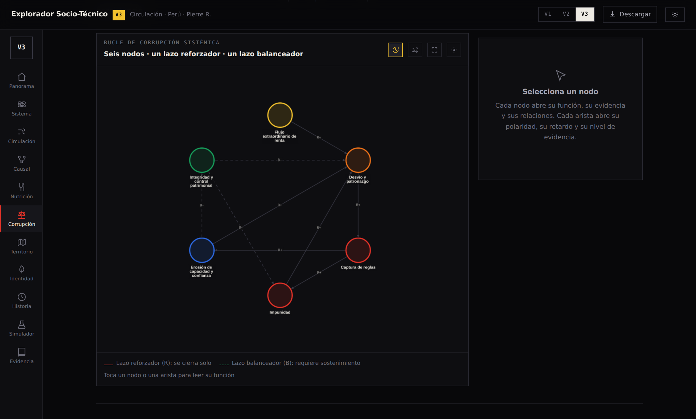
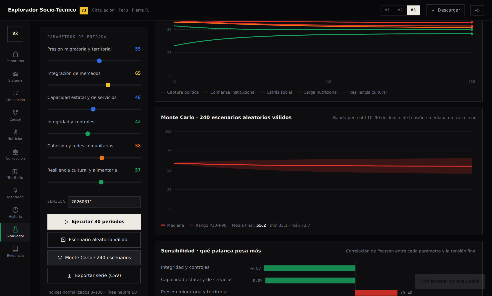
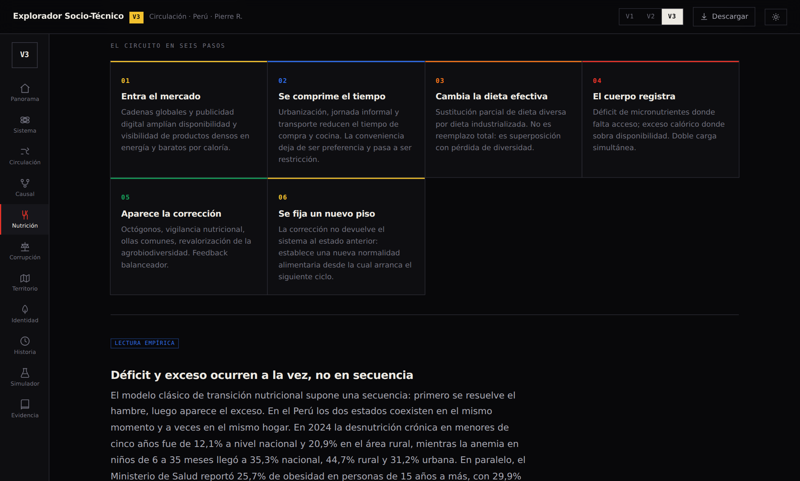

<div align="center">

# Explorador Socio-Técnico del Perú

**Cómo circula todo: territorio, mercado, cuerpo, poder e identidad.**

Un laboratorio interactivo que descompone la sociedad peruana como un sistema
abierto de cinco ejes acoplados, con grafos dinámicos, evidencia trazable
y un simulador estocástico.

*Estudio y modelo sistémico planteado por Pierre R.*

<br>

### 🚀 [ABRIR LA VERSIÓN 3 →](https://oprbguitar.github.io/explorador-sociotecnico/v3.html)

Publicado en GitHub Pages. Las tres versiones conviven y se alcanzan
desde el selector superior de cualquiera de ellas.

[V1 · original](https://oprbguitar.github.io/explorador-sociotecnico/) ·
[V2 · lentes múltiples](https://oprbguitar.github.io/explorador-sociotecnico/v2.html) ·
**[V3 · Circulación](https://oprbguitar.github.io/explorador-sociotecnico/v3.html)**

<br>


<br>



</div>

---

## La tesis en un párrafo

> La sociedad peruana no se explica por una sola causa. Se explica por **lo que circula
> entre sus partes**: personas, dinero, alimentos, información, legitimidad. Cuando un
> flujo se acelera y otro se traba, aparece la tensión. Cuando la tensión se acumula sin
> corrección, aparece el ciclo.

De ahí la regla central del modelo, que la V3 aplica tres veces sobre datos distintos:

**Donde un flujo entra más rápido de lo que el stock receptor puede absorber, el excedente
no desaparece: se convierte en tensión almacenada en otro eje.**

| El flujo entra… | …más rápido que | El excedente se almacena como |
|---|---|---|
| Mercado alimentario | la regulación sanitaria | doble carga nutricional en el cuerpo |
| Migración interna | el saneamiento y la vivienda | informalidad y presión urbana |
| Renta pública | el control patrimonial | captura política |

---

## El sistema en un diagrama



`R` = lazo reforzador (se cierra solo) · `B` = lazo balanceador (requiere sostenimiento activo).
Esa asimetría —reforzadores automáticos, balanceadores voluntarios— es el hallazgo estructural
del modelo: por defecto, el sistema acumula tensión.

En el explorador, ese mismo diagrama es interactivo: el pentágono de ejes queda dentro del
anillo de las cuatro fases del ciclo, y cada nodo y cada arista abren su ficha.



---

## Qué trae la V3

<table>
<tr><td width="34%">

### 🌀 Circulación
Diagrama animado de los **cinco flujos** —personas, dinero, alimentos, información,
legitimidad— con su velocidad relativa y su ancla empírica. Es la lente nueva de esta versión.

</td><td width="33%">

### 🍽️ Nutrición en profundidad
El eje central del esquema. Circuito de seis pasos, siete lecturas empíricas con fuente,
cuatro tensiones de diseño y una lectura interpretativa claramente separada.

</td><td width="33%">

### ⚖️ Estudio de la corrupción
Módulo nuevo. Tres marcos (Quiroz · Crabtree y Durand · Buscaglia), un bucle de seis nodos
con lazo reforzador y balanceador, y el vínculo causal explícito con el eje nutricional.

</td></tr>
<tr><td>

### 🧪 Simulador estocástico
Genera **escenarios aleatorios válidos** a partir de tres factores latentes correlacionados,
corre Monte Carlo con 240 escenarios y calcula sensibilidad por parámetro.

</td><td>

### 🕸️ Grafos deterministas
Pentágono con anillo cíclico y distribución radial ponderada por eje. Mismo mapa en cada
carga —se puede memorizar— con layout de fuerza como alternativa opcional.

</td><td>

### ⬇️ Todo descargable
Capítulo actual o dossier completo en Markdown, modelo en JSON, indicadores y relaciones
causales en CSV, serie del simulador en CSV, e impresión a PDF.

</td></tr>
</table>

<br>

### Circulación — qué se mueve y a qué velocidad

Cinco flujos recorren el pentágono. Cada uno tiene su velocidad, su unidad y un ancla empírica.
El desfase entre un flujo inmediato y un stock que cambia en décadas es lo que produce la tensión.



### Corrupción — el bucle, no el escándalo

Seis nodos y dos lazos. El reforzador —renta, desvío, captura, impunidad— se cierra solo.
El balanceador —integridad y control patrimonial— solo corrige mientras se le sostenga.



### Simulador — la distribución, no el caso

Monte Carlo sobre 240 escenarios aleatorios válidos, con banda de percentiles y análisis de
sensibilidad. En la corrida de referencia, integridad y controles (−0,87) y capacidad estatal
(−0,85) dominan sobre presión migratoria (+0,40) e integración de mercados (+0,32).



---

## Los once capítulos

| # | Capítulo | Qué responde |
|---|---|---|
| 1 | **Panorama** | Seis cifras que ordenan el resto, los cinco ejes y las cuatro fases del ciclo |
| 2 | **Sistema** | Grafo de ejes dentro del anillo cíclico; lazos reforzadores y balanceadores |
| 3 | **Circulación** | Qué se mueve, a qué velocidad y por qué el desfase produce tensión |
| 4 | **Causal** | 41 relaciones con polaridad, retardo y nivel de evidencia declarado |
| 5 | **Nutrición** | Por qué déficit y exceso conviven, y qué circuito los produce |
| 6 | **Corrupción** | Por qué es un sistema circulatorio y no una sucesión de escándalos |
| 7 | **Territorio** | Costa, Sierra y Selva comparadas en las mismas siete variables |
| 8 | **Identidad** | Por qué la identidad opera como condición de acceso |
| 9 | **Historia** | Dieciséis hitos que muestran la repetición de las fases |
| 10 | **Simulador** | Qué palanca pesa más cuando se prueba todo el espacio de escenarios |
| 11 | **Evidencia** | 27 fuentes con su rol, glosario operativo y reglas del proyecto |

<br>

El eje nutricional es el corazón del esquema: el único donde el sistema deja de ser abstracto
y se vuelve medible en el cuerpo. Un país con anemia infantil en más de un tercio de los niños
y obesidad en uno de cada cuatro adultos no tiene dos problemas nutricionales — tiene un solo
circuito que entrega poca densidad de nutrientes y mucha densidad de energía, de forma desigual
por territorio, por ingreso y por tiempo disponible.



---

## La regla metodológica

Ninguna afirmación circula en este explorador sin una etiqueta de nivel. Se muestran
distinto porque **no valen lo mismo**:

| Nivel | Qué significa | Dónde aparece |
|:--|:--|:--|
| 🔵 `dato` | Cifra publicada por una fuente identificable | Indicadores, tablas regionales |
| 🟢 `documentada` | Mecanismo sostenido por literatura especializada | Relaciones causales sólidas |
| 🟡 `hipótesis` | Relación plausible del modelo, sin verificar | Aristas tenues del grafo |
| 🟠 `estimación` | Cifra de autor a contrastar con la edición impresa | Módulo de corrupción |
| 🔴 `interpretación` | Lectura de sentido, explícitamente **no rigurosa** | Bloques en rojo, separados |

Las lecturas interpretativas —el cuerpo como archivo, la corrupción como pacto silencioso—
están dentro del explorador porque el fenómeno las tiene. Están marcadas y aisladas porque
mezclarlas con la evidencia sería más vistoso y menos honesto.

---

## Arquitectura

<details>
<summary><b>Estructura de archivos</b></summary>

```
explorador-sociotecnico/
├── index.html              V1 — dashboard original (intacto)
├── system-core.js          V1 — modelo de datos
├── app.js                  V1 — controlador
├── styles.css              V1 — estilos
│
├── v2.html                 V2 — lentes múltiples
├── v2.css, v2-enhancements.css
├── v2-data.js, v2-data-next.js
├── v2.js, v2-next.js, v2-simulation-engine.js
│
├── v3.html                 V3 — «Circulación»
├── v3.css                  Sistema visual: paleta básica, claro/oscuro, impresión
├── v3-data.js              Base de conocimiento única (ejes, variables, relaciones,
│                           indicadores, módulos, fuentes, glosario, textos)
├── v3-sim.js               Motor estocástico: RNG con semilla, escenarios válidos,
│                           Monte Carlo, sensibilidad de Pearson
├── v3-app.js               Capítulos, grafos, inspector, exportación
│
├── vendor/cytoscape.min.js Cytoscape 3.26.0 (MIT), servido localmente
├── docs/                   Arquitectura y registro de fuentes
├── fuentes/                Documentos de trabajo del estudio
└── LICENSE                 MIT (código) + CC BY 4.0 (contenido)
```

</details>

<details>
<summary><b>Decisiones técnicas</b></summary>

- **Cero dependencias externas en tiempo de ejecución.** Cytoscape se sirve desde
  `vendor/`, no desde una CDN. La V3 funciona sin conexión una vez cargada y no se cae
  si una CDN falla. La tipografía Inter se pide a Google Fonts pero degrada a la fuente
  del sistema sin pérdida de diseño.
- **Sin framework ni build.** HTML, CSS y JavaScript. Se abre con doble clic o se
  publica en cualquier hosting estático. No hay paso de compilación que mantener.
- **Una sola fuente de verdad.** Todo el contenido analítico vive en `v3-data.js`.
  Cambiar una cifra, una relación o un texto no requiere tocar la interfaz.
- **Layouts deterministas.** Los grafos usan posiciones calculadas (pentágono, radial
  ponderado por número de variables, hexágono de bucle) en lugar de un layout de fuerza.
  Distribuyen mejor y —lo importante— se ven igual en cada carga, lo que permite
  memorizar el mapa. El layout de fuerza queda como opción, no como comportamiento
  por defecto.
- **Paleta de colores básicos.** Cinco colores —azul, amarillo, naranja, rojo, verde—
  sobre negro, con hueso reservado para titulares y cifras. El color nunca decora:
  marca eje, dato o estado.
- **Accesible y responsive.** Contraste alto, foco visible, `prefers-reduced-motion`
  respetado, sin desbordamiento horizontal en móvil, hoja de estilos de impresión.

</details>

<details>
<summary><b>Cómo ejecutarlo en local</b></summary>

```bash
git clone https://github.com/oprbguitar/explorador-sociotecnico.git
cd explorador-sociotecnico

# opción 1: abrir directamente
open v3.html            # macOS  ·  en Windows: start v3.html

# opción 2: servidor local (recomendado, evita restricciones de file://)
python3 -m http.server 8080
# → http://localhost:8080/v3.html
```

No hay `npm install`, ni bundler, ni variables de entorno.

</details>

<details>
<summary><b>Cómo modificar el modelo</b></summary>

Todo está en `v3-data.js`:

| Quiero… | Edito… |
|---|---|
| Añadir un indicador | `indicators[]` — con `src` apuntando a un id de `sources[]` |
| Añadir una relación causal | `causal[]` — con `p`, `delay`, `level` y `ev` obligatorios |
| Añadir una variable | `variables[]` — el grafo la coloca sola en el sector de su eje |
| Cambiar un texto largo | `nutrition`, `corruption`, `territory`, `identity` |
| Añadir una fuente | `sources[]` — con su `role`: calibración, evidencia o conceptual |
| Ajustar el simulador | `simulation` en `v3-data.js`; las ecuaciones, en `v3-sim.js` |

La interfaz se regenera sola: no hay que tocar `v3-app.js` para cambiar contenido.

</details>

---

## Fuentes

27 fuentes registradas con su rol declarado. Las principales:

**Calibración** — INEI (Censos, ENAHO, pobreza, servicios básicos, TIC, gobernabilidad,
producción y empleo informal), ENDES, MINSA/INS, Ministerio de Cultura (BDPI),
Banco Mundial, OPS, FAO.

**Evidencia** — Ley 30021 y octógonos de advertencia, RENAMU, AIDESEP, UNESCO,
GSMA Intelligence, estudios peruanos sobre ultraprocesados y la cohorte PERU MIGRANT.

**Marco conceptual** — Matos Mar, Quijano, García Canclini, Quiroz,
Crabtree y Durand, Buscaglia, Maté.

> Las obras conceptuales se usan por su tesis y sus mecanismos explicativos.
> **Sus textos no se redistribuyen en este repositorio.** Las cifras que discuten se
> presentan como órdenes de magnitud atribuidos al autor y deben contrastarse contra
> la edición impresa antes de citarse en un trabajo académico.

El registro completo, con cobertura, periodicidad y uso de cada fuente, está en el
capítulo **Evidencia** del explorador y en [`docs/SOURCE_REGISTRY.md`](docs/SOURCE_REGISTRY.md).

---

## Advertencia

Este explorador es un **instrumento de análisis, no un sistema de pronóstico**.

Las cifras provienen de las fuentes citadas. Las relaciones causales y la simulación son
construcciones del modelo. Ninguna salida numérica del simulador describe una medición real
del Perú: son índices normalizados 0–100 con coeficientes heurísticos, pensados para
comparar escenarios entre sí y no para estimar niveles.

---

## Licencia

| Componente | Licencia |
|---|---|
| Código (HTML, CSS, JavaScript) | **MIT** |
| Contenido analítico (textos, modelo, datos estructurados, documentación) | **CC BY 4.0** |
| `vendor/cytoscape.min.js` | MIT — The Cytoscape Consortium |
| Datos oficiales de terceros | Términos de cada institución emisora |

Detalle completo y exclusiones en [`LICENSE`](LICENSE).

<div align="center">
<br>

**Explorador Socio-Técnico del Perú · V3 «Circulación»**

Estudio y modelo sistémico planteado por Pierre R.

</div>
